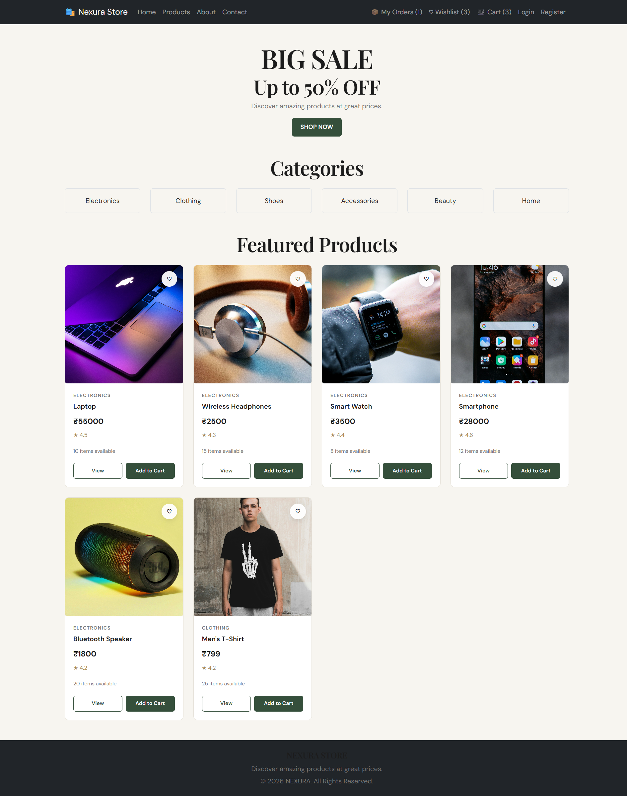
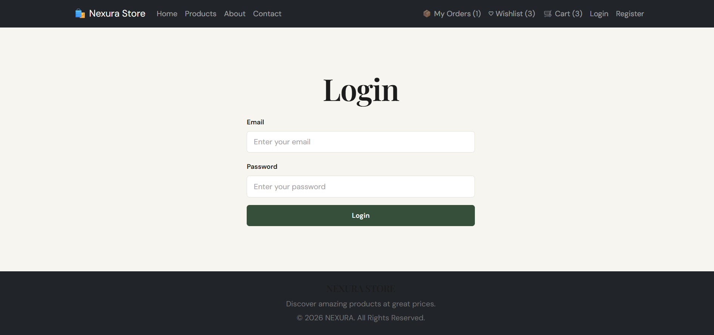
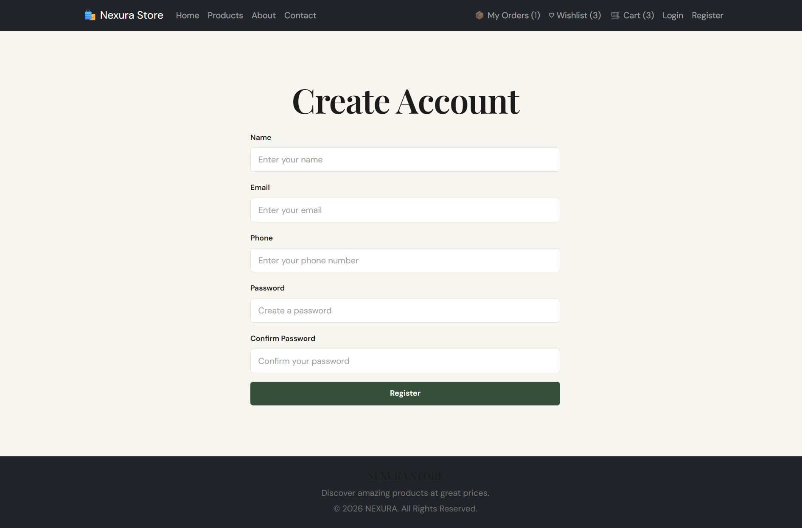
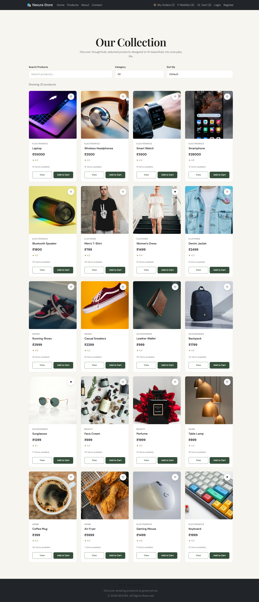
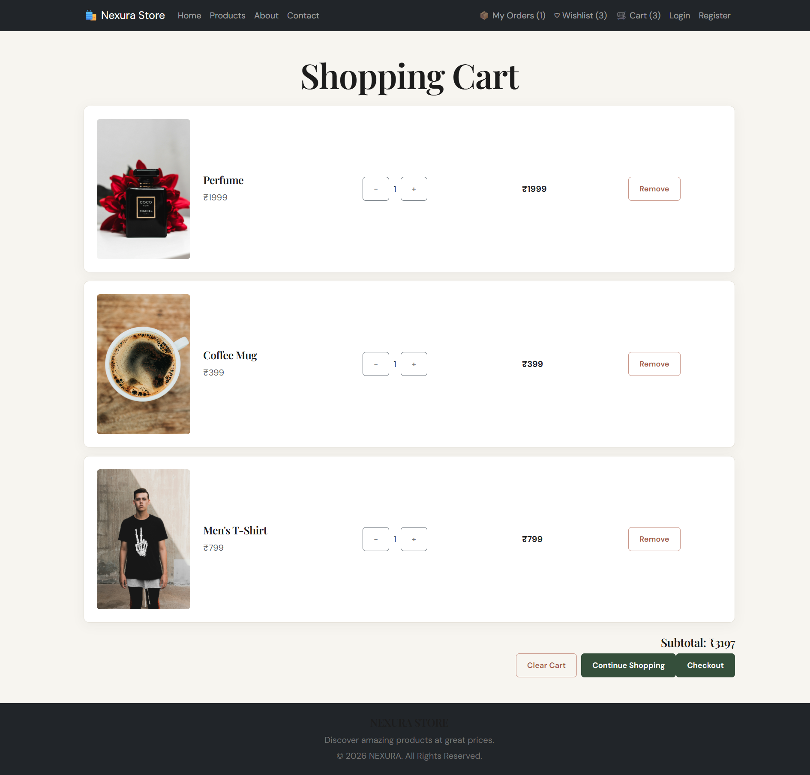
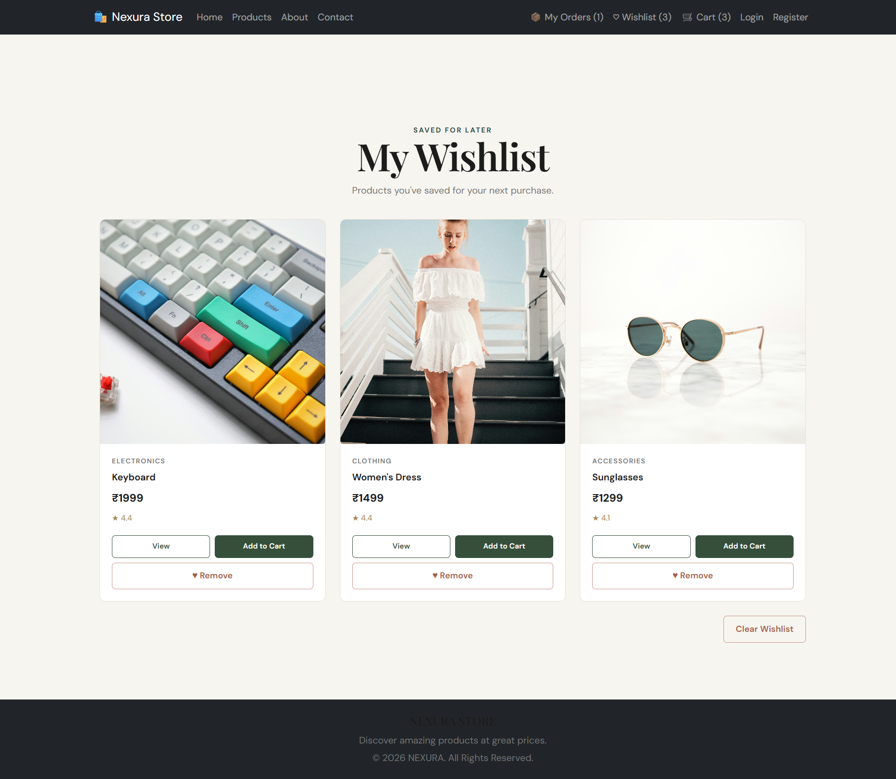
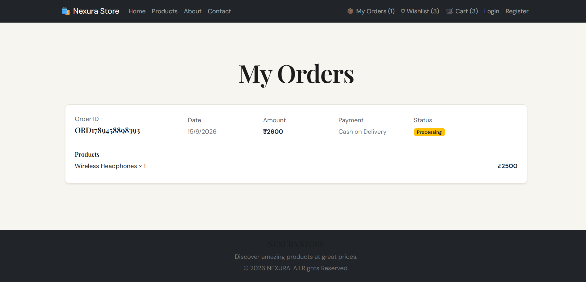
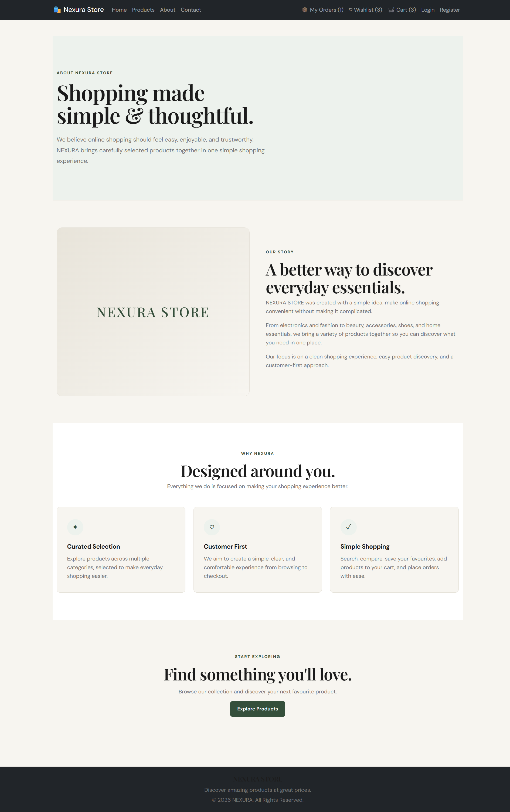
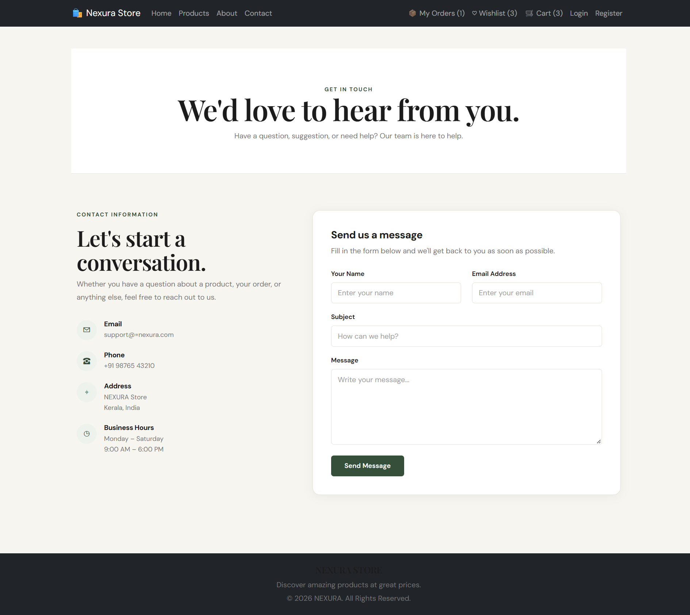

# React E-Commerce Website

A full-featured e-commerce web application built with React, Redux Toolkit, and React Router. It includes product browsing, cart management, wishlist, user authentication, and order tracking — designed to simulate a real online shopping experience.

## Features

- User registration and login
- Browse products with detailed product pages
- Add products to cart and wishlist
- Checkout and order placement
- View order history
- About and Contact pages
- Responsive design for mobile and desktop

## Tech Stack

- **Frontend:** React, Redux Toolkit, React Router
- **State Management:** Redux Toolkit, Context API
- **Styling:** CSS

## Screenshots

### Home Page


### Login Page


### Register Page


### Product Page


### Cart Page


### Wishlist Page


### My Orders Page


### About Page


### Contact Page


## Getting Started

Clone the repository and install dependencies:

```bash
git clone https://github.com/SreedeviKV13/react-ecommerce-website.git
cd react-ecommerce-website
npm install
npm start
```

The app will run at `http://localhost:3000`.

## Author

**Sree**
[GitHub](https://github.com/SreedeviKV13)